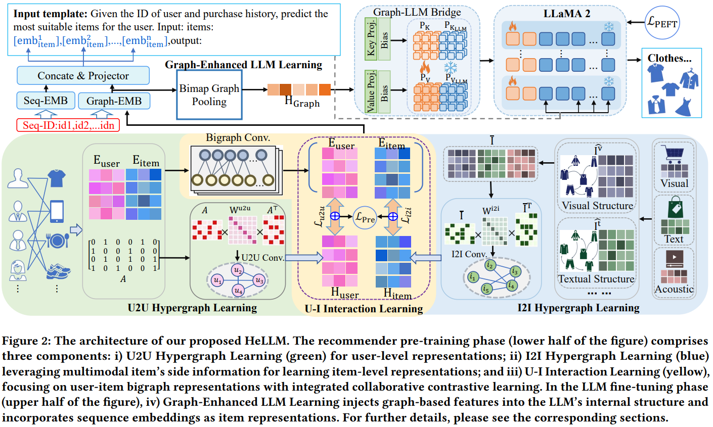
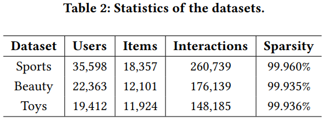

# HeLLM: Multi-Modal Hypergraph Enhanced LLM Learning for Recommendation

This is our Pytorch implementation for the paper: [HeLLM: Multi-Modal Hypergraph Enhanced LLM Learning for Recommendation](https://arxiv.org/pdf/2504.10541).

<p align="center">

</p>

🚀HeLLM is a novel multi-modal recommendation framework that synergizes hypergraph-enhanced representation learning with large language model (LLM) fine-tuning. 
It builds two hypergraphs: a user-to-user (U2U) hypergraph to capture shared user preferences, and an item-to-item (I2I) hypergraph to model complex multimodal semantic correlations between items. 
These graph-based representations are fused via synergistic contrastive learning, then injected into an LLM (e.g., LLaMA-2) through a graph-enhanced PEFT mechanism, enhancing the LLM's ability to perceive and reason over complex relational patterns. 
Furthermore, the enhanced LLM incorporates time-series and multi-view graph structural embeddings to effectively capture user temporal behaviors and high-order user-item correlations, for improving recommendation performance.
<h2>Dependencies </h2>
The code has been tested with Python 3.13.4. 
All experiments were conducted on an NVIDIA RTX 3090/4090 GPU with 24GB of memory. 
The required packages are listed in the 'requirements.txt' file.

```
conda create -n HeLLM python=3.13.4

conda activate HeLLM

pip install -r requirements.txt
```

<h2>Datasets</h2>

The original recommendation datasets can be found at [Amazon product data (2018)](http://jmcauley.ucsd.edu/data/amazon/links.html) (Click ESC to stop redirection).

✨✨  
For pretraining, we provide **three publicly available pre-processed datasets** that require no additional processing. These include:  
(1) basic user-item interaction data, and  
(2) multi-modal features.  
You can download them from [Google Drive](https://drive.google.com/drive/folders/1Up4o7SA33YqZzN7L_ZeOZ83bHt4W95zV?usp=drive_link) / [Baidu Cloud](https://pan.baidu.com/s/19ST11B4yiXTcXTwJA46oBg?pwd=pgn6) (HeLLM_pre_data).

The pre-training model is derived from our previous work [MMHCL](https://github.com/Xu107/MMHCL), in which we pretrained state-of-the-art user and item embeddings for multimodal collaborative filtering. 
You can use the datasets linked above to pretrain the graph-based embeddings accordingly.

🔖🔖
For convenience, we directly release the **pretrained graph-based embeddings** on [Google Drive](https://drive.google.com/drive/folders/1IJ1M4LraypXLLiBZnyLrzo5Xifw1kPYi?usp=drive_link) / [Baidu Cloud](https://pan.baidu.com/s/1VBNJq9-Zo7fa0QXC41SePw?pwd=nbs4) (HeLLM_ft_data), which can be used for LLM fine-tuning in this code repository. 
Please follow the instructions below to fine-tune the HeLLM model.

🔥🔥 
To facilitate reproducibility and further development of multimodal recommender systems, we also provide reference code for preprocessing the [original Amazon datasets](http://jmcauley.ucsd.edu/data/amazon/links.html) in `preprocess/data_preprocess.ipynb`. 
We invested substantial effort into this preprocessing pipeline. 
If you find it helpful in your work, please kindly consider citing our work.

<p align="center">

</p>
<h2>Usage </h2>

Download and place the [HeLLM_ft_data](https://drive.google.com/drive/folders/1IJ1M4LraypXLLiBZnyLrzo5Xifw1kPYi?usp=drive_link) 
and [Llama-2-7b weight](https://huggingface.co/meta-llama/Llama-2-7b/tree/main) in the project subdirectory:
  ```
  ├─ HeLLM/ 
      ├── datasets/
        ├── sequential/
            ├── Beauty/
            ├── Sports_and_Outdoors/
            ├── Toys_and_Games/
            ...
      ├── Llama-2-7b/
        ├── consolidated.00.pth/
        ├── tokenizer.model/
        ...
      ├── utils/
        ...
      config_HeLLM.py
      train_HeLLM.py
      retuirements.txt
  ```
Start training and inference as:

```
cd HeLLM
python ./train_HeLLM.py 
```
Supported datasets: `Beauty`, `Sports_and_Outdoors` ,`Toys_and_Games`. 
More parameter tuning can be changed in file `config_HeLLM.py`. And the best training log in `/log`.

<h1> Citing </h1>

If you find this work helpful to your research, please kindly consider citing our paper.


```
@article{guo2025multi,
  title={Multi-Modal Hypergraph Enhanced LLM Learning for Recommendation},
  author={Guo, Xu and Zhang, Tong and Wang, Yuanzhi and Wang, Chenxu and Wang, Fuyun and Wang, Xudong and Zhang, Xiaoya and Liu, Xin and Cui, Zhen},
  journal={arXiv preprint arXiv:2504.10541},
  year={2025}
}
```


## Acknowledgement

The structure of this code is mainly based on [Llama2](https://github.com/meta-llama/llama/tree/main), [GraphLLM](https://github.com/mistyreed63849/Graph-LLM) and [E4SRec](https://github.com/HestiaSky/E4SRec/). Thanks for their excellent public work!

